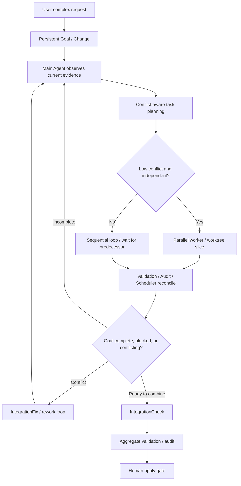
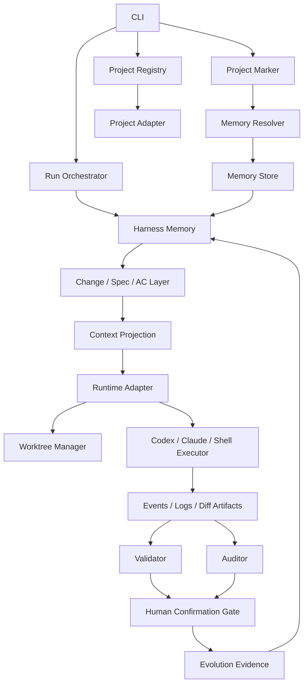

# Architecture

> Status: AHO uses one Shared Conversation, one canonical timeline, one static
> Provider Registry, and provider-fixed model attempts above provider-neutral
> Workflow and AgentTask owners. Codex is the first concrete adapter. Native
> Goal is provider continuity, not workflow truth or execution authority;
> Workbench is an intent/projection surface and the server-owned Agent Relation
> Graph is its only Agent graph fact. GoalLoop/controller/packet, fake planner,
> direct Codex production entrypoints, legacy Workbench transcript readers, and
> dual timeline/graph paths are retired. The detailed phase ledger below is
> historical context, not current architecture.

## 1. Current Status

Agent Harness Orchestrator is a single-package TypeScript CLI plus a local browser Workbench shell and the Beaver Code Electron desktop host. It currently manages local project registration, Harness audit/init, ECL index rebuilds, structured change creation/status/close, demand conversation interaction logs, Workbench SQLite interaction/config state, AHO skill sources, Codex bridge projection, main planning-agent proposal bundles, Acceptance Criteria parsing, task mapping, generated `ac-map.json`, explicit `spec-tests.json` evidence mapping, deterministic Spec-Test drift diagnostics, local command run artifacts, Codex read-only proposal artifacts, validation artifacts, Auditor proposal artifacts, Codex Coder proposal artifacts, apply/discard artifacts, diagnostic memory status, opt-in external-local memory, AHO-owned worktrees, Workpad snapshots, TaskGraph projection, TaskRun / WorkerLease orchestration records, local TaskRun Queue, role pipeline projection, Decision Inspector projection, and local result review/apply handoff.

### Beaver Code desktop composition

The Windows update foundation adds one Desktop Update Coordinator and an NSIS adapter
in Main. The coordinator depends on a narrow generation/request-bound lifecycle port;
Workbench owns update preparation, and Renderer draft owners acknowledge stable CAS
revisions through authenticated HTTP/SSE. Update metadata and signature policy never
flow into the domain layer. Installation requires both a successful shutdown receipt
and a normal Utility exit. Ordinary application quit cannot implicitly install an update.

Request draining distinguishes transport writes from already admitted managed execution.
An SSE header does not prove admission: the existing Turn Control Owner emits a narrow
registration notification. A server-only async request context attributes that fact to
the correct request, covering ordinary, queued, Review and Retry execution without
route-specific observers. Workbench has no dependency on that transport context.
Uncertain submission blocks updating.

```text
Electron Main
  -> window, menu, single instance, native folder dialog, supervision
  -> versioned MessagePort lifecycle protocol
Electron Utility Process
  -> existing Workbench Server, Provider Runtime, SQLite, Terminal and Harness owners
BrowserWindow
  -> authenticated random-port loopback HTTP/SSE only
```

Electron Main owns no Conversation, Provider, SQLite, Timeline, Change, Workflow, Run, validation, audit, or source-transition state. The Utility Process starts the existing `startWorkbenchServer()` composition and keeps Node/TypeScript Core authoritative. The Renderer has no Node integration or general IPC surface. Desktop authentication, shutdown and native folder selection are opt-in host ports, so the CLI and ordinary browser Workbench retain their existing composition.

### Agent Office choreography composition

Agent Office calibration V5 separates spatial geometry from action posture. A
handoff stores one shared outbound path; `OfficeCalibrationResolver` derives the
return path by reversing its stages and points. Independent action-instance
mirror values remain part of the same V5 document. `OfficeActivityCompiler`
owns pose depth (`seated` or `mobile`) and emits explicit depth commands;
renderers only reparent the existing actor container between calibrated layers
and never infer depth from action names or coordinates.

The long-term architecture is a local-first Agent Development OS with a Spec-Anchored Harness Kernel. AHO keeps durable project memory in AHO-managed stores, prepares context for constrained external agents, records execution evidence, and routes local source transitions through explicit bounded authorization while remote landing and Harness evolution remain separately confirmed.

The current target architecture is governed by
`docs/design-docs/harness-workflow-runtime-target.md`: the main Agent owns
provider-native Goal continuity, state review, handoff, and next-round
completion judgment; the real parent-spawned Plan child owns Plan /
WorkflowPlan drafting and revision; Workflow Runtime owns confirmed execution
orchestration; worktrees isolate write-capable code leaves; Harness
docs/evidence remain project memory. Codex native Goal and subagents are
provider capabilities, not AHO workflow truth.

Current provider relationship:

```text
Shared Conversation / Change / Workflow / AgentTask
-> provider-neutral operation profile and capability gate
-> Provider Registry
-> Codex Adapter (current concrete provider)
-> provider-private session, event, Skill, model, and diagnostic protocol
```

Workbench Conversation execution is composed at the server boundary. The
composition root constructs the runtime coordinator, Provider Registry,
`ProjectSkillRuntimeContextResolver`, and `ConversationTurnRouter` together.
The Router resolves one immutable per-turn Skill context before dispatching to
Agent or ready Harness Main, so Provider request inputs, required-native Skill
Attempt evidence, and handoff hashes share one source. The onboarding Main path
remains a separate zero-discovery path. Conversation Service and interaction
settlement receive the composed Router; they do not assemble a default Provider
or Skill resolver internally.

The canonical timeline is persisted before realtime projection and is the sole
user-history owner for Main, child, and background Agents. Provider-native
history is diagnostic/reconciliation evidence only. A provider switch is legal
only after active turns and children stop, old writers are fenced, Workflow and
worktree evidence is reconciled, and a hashed ResumePoint plus new immutable
ProviderAttempt are recorded. Authorization remains bound to accepted AHO
artifacts and current evidence, never to a provider session.

## Historical Architecture Ledger

The phase detail below is retained only to locate older archive material. It
does not describe supported runtime owners or implementation directions.

Phase 5S added a deterministic intake loop before Spec. Phase 5T/5U added task-level execution projection and TaskRun / WorkerLease orchestration. Phase 5W added local sequential queueing, Phase 5X aligned human decision context, Phase 5Y defined Coding Work Package as the default coder-agent assignment grain, Phase 6A/6B moved planning and execution results into one demand conversation, Phase 6C aligned the sidebar with project folders and nested demand conversations, Phase 6E introduced an optional app-server runtime adapter for steerable planning/coder turns, Phase 6F completed the local result review/apply handoff, Phase 6G introduced AgentTaskRepository/background maintenance candidates, Phase 6H added demand-level queueing, and Phase 6I made the parent-agent conversation the default surface. Phase 6J extends the demand queue to bounded independent demand concurrency. Phase 6K scopes result apply/discard to explicit demand result targets and turns source drift into a fresh same-demand rework attempt. Phase 6L keeps the center as parent-agent explanation and moves human-gate items into a narrow confirmation queue, with a temporary local integration check before applying multiple ready results. Phase 6M adds local IntegrationFix attempts for failed combined-result checks without introducing remote merge queues. Phase 6N prepares local landing readiness evidence and merge-reviewer verdicts after user-confirmed source-root apply. Phase 6O creates the first remote handoff boundary by preparing and optionally creating a Draft PR through GitHub CLI. Phase 6P reads Draft PR feedback/checks as remote evidence and routes actionable feedback through the same demand's AgentTask rework path before updating the existing Draft PR branch after confirmation. Phase 6Q marks safe Draft PRs ready for human review after confirmation. Phase 6R handles the review feedback that arrives after human review starts: comments, inline comments, user stance, same-demand rework, reply draft, and optional thread resolve. Phase 6S consolidates terminal demand memory and doc drift evidence without interrupting the demand confirmation queue. Phase 6T is the first remote landing slice: a clean, ready PR can be merged by GitHub CLI only after explicit user confirmation, and the successful merge becomes a `merged` closeout input for maintenance memory. Phase 6U reconciles remote/local state after merge and exposes only safe fast-forward local sync or remote PR head branch cleanup. Phase 6V adds project-level landing queue coordination for multiple ready PRs, while still requiring a fresh readiness check and user confirmation for each individual merge. Phase 6W/6X reshape the center UI into a parent-agent transcript plus inline run graph. Phase 6Y introduces the controlled `delegateTask` contract and transcript process rows. Phase 6Z makes policy-gated main-agent tool orchestration the foreground role path and adds post-run boundary audits for role outputs. Phase 7A/7B make Codex runtime/replay cells the only default conversation renderer input. Phase 7C made the first-screen Workbench snapshot a lightweight shell and moved heavy transcript, graph, detail, evidence, maintenance, and landing queue views behind scoped lazy loaders. Phase 7D adds ChangeTarget binding so runnable entrypoints and selected close/abandon/finalize actions can use explicit active demand targets while legacy CLI paths keep single-active fallback. Phase 7E adds RoleContextPacket artifacts so core worker role runs receive scoped, auditable context instead of shared parent chat or full Harness context. Phase 7F moves the default foreground role-order policy into `MainAgentOrchestrationDecisionEngine`, which derives coder/validator/auditor/rework next steps from recorded evidence instead of hidden Workbench control flow.

## 2. Product Kernel

The product kernel is not "run many agents." The kernel is keeping specs, acceptance criteria, plans, tasks, code changes, validation, review, and Harness evolution synchronized.

Core chain:

```text
User Intent
-> Demand Conversation
-> Intake / Clarification
-> Main Agent Goal brief / state brief / constraints
-> Plan Agent Plan / WorkflowPlan proposal
-> Human confirm Plan
-> Workflow Runtime / ToolPolicyGate
-> Scoped leaf execution
-> AHO-owned worktree for write-capable code leaf
-> Coder Agent proposal/diff
-> PostRunBoundaryAudit
-> Validator result
-> Auditor Agent evidence
-> Human confirm apply/merge
-> Spec/Status update if needed
-> Archive
-> Evolution evidence
-> Human confirm Harness evolution
```

This chain is a safety and evidence contract, not a mandatory role order. The main agent may clarify, split a request, create or select Changes, delegate roles, repeat validation-driven repair, or stop for user input. The invariant is that write-capable work and high-impact transitions pass through explicit Change binding, scoped context, evidence records, and human gates.

Core mechanism reuse is now part of the product kernel. New product features should reuse or strengthen shared owners for artifacts, lineage and stale-target guards, authority boundaries, ledger events, projection summaries, action/gate target revalidation, human-gate evidence, and ToolPolicy-related checks. Feature modules should express domain differences; cross-cutting behavior should not be reimplemented as a feature-local framework, state machine, validation system, projection system, or protocol.

When an existing shared owner is insufficient, the architecture target is to create or extend a reusable mechanism with clear ownership before adding feature-specific branches. Surface modularity, file count, and line count are review signals only; a change is healthier when it reduces the cost of the next similar feature while preserving workflow truth, accepted artifacts, validation/audit, IntegrationCheck, and human gates.

Domain relationship:

```text
Project -> Change -> Spec / Acceptance Criteria -> Plan -> Tasks
-> Context Projection -> Run -> Events / Artifacts -> Validation / Review
```

Target runtime-boundary chain:

```text
MainAgent
-> ChangeGuard
-> RoleContextPacket / Context Projection
-> Worker
-> Harness Event Sink
-> GateEvaluator
```

`ChangeGuard` is a future boundary concept: any mutating run must bind to an explicit `changeId` or create/select a future lightweight Draft Change before write capability is granted. `Harness Event Sink` records intent, context refs, diffs, validation, reviews, decisions, and closeout inputs. `GateEvaluator` checks those records before apply, close, archive, merge, or memory/documentation promotion. These names describe the target direction; Phase 7C and earlier phases do not yet implement them as a single runtime API.

Phase 7D implements the first narrow slice of that boundary as `ChangeTarget`. `RunnableChangeTarget` resolves active Changes for code, validation, audit, TaskRun, local run, Codex run, spec-test, proposal, and agent runtime entrypoints. `CloseableChangeTarget` resolves active Changes for close, abandon, and apply auto-finalize. These targets are derived from Change/ECL facts and do not replace Change, Context Projection, evidence records, or human gates.

Phase 7E implements the next slice as context packet artifacts. Core coder, validator, auditor, and rework-coder runs write `context-packet.json` and model-facing `context.md`; run metadata records the packet ref/hash. This makes A2A context an evidence handoff: main agent delegates, Harness selects the scoped Change/evidence packet, a worker runs as a leaf role, and the result returns through run/validation/audit/boundary artifacts.

Phase 7F introduced foreground code-change role evidence. `MainAgentOrchestrationState` records role steps, selected input/output evidence, failure classification, and the bounded rework budget. Covered production scheduling has since moved into `workflow-runtime`: the default template runs coder/rework, validator, and auditor through `default-code-change-workflow`, while rework-only flows share a single Workflow Runtime sequence owner. The old fixed role-chain runner and decision policy are not a current production boundary.

Phase 7H added the first proposal boundary for future WorkflowPlan / DecompositionPlan work above this decision engine. The target direction is main-Agent Goal review plus Plan-Agent-authored deterministic workflow-as-artifact for a complex demand: classify the demand as single-Change, multi-task-in-one-Change, multi-Change candidate, or needs clarification; describe child tasks, dependencies, conflict hints, AC coverage, file/module scope, pipeline/barrier relationships, required role runs, and synthesis evidence. The plan is not workflow truth and does not execute high-impact actions. Confirming a DecompositionPlan records proposal acceptance only; AHO still must not create child Changes, TaskGraph execution units, AgentTasks, TaskRuns, or code runs from that confirmation. Phase 7I adds a DecompositionReadinessManifest between proposal acceptance and any future executor. It is a typed guardrail verdict over the latest confirmed plan and accepted Harness facts, not an executable workflow graph or scheduler trigger. Phase 7J makes that verdict enforceable for code-producing execution: direct `code.run` is allowed only for `ready-for-single-change`, while `ready-for-sequential-taskqueue-proposal` must first become a typed TaskQueueProposal. Phase 7L inserts a versioned `WorkflowGraphPlan` compile step between TaskQueueProposal and TaskQueue start. Graph compile locks the matching proposal/readiness refs into immutable execution input and does not create WorkflowRun, TaskQueue, TaskRun, AgentTask, worktree, or agent calls. The current `sequential-v1` graph shape is an implementation limit; the target architecture is a unified typed execution graph that can later express sequential, ready-set, barrier, pipeline, and scheduler-wave modes without becoming a model-authored JavaScript script.

Harness validates and locks accepted Agent-authored plans into scoped runtime records. It does not generate the business plan by itself. Every leaf worker still binds to explicit `changeId`, TaskGraph node ids, role id, RoleContextPacket / EvidenceContextPacket refs, permission profile, worktree/session, and run ids. Workers remain leaf roles and cannot freely spawn more agents unless a later AgentSpec and ToolPolicyGate explicitly allow bounded delegation. Workflow phase/agent/run events may feed Workbench graph and detail projections, but Change/ECL, TaskGraph, AgentTaskResult, validation, audit, apply/merge/close records, and human gates remain authoritative.

WorkflowRun recovery is execution-progress recovery only. Phase 7K implements this for confirmed sequential TaskQueue execution: AHO records typed `WorkflowRun` state and append-only events, recomputes accepted artifact, proposal, readiness, source, policy, and capability hashes on resume, and continues only when the paused `WorkflowRun + TaskQueueRun` still matches. Missing records, stale context, source drift, policy drift, or failed worktree isolation must fail closed and stop for user input. Reused progress still requires validation, audit, and human confirmation before any source or canonical-state transition.

Phase 7L tightens that recovery boundary: a started WorkflowRun records the versioned WorkflowGraphPlan, proposal snapshot, readiness snapshot, and graph hash that authorized it. Resume/reconcile must use those versioned refs from WorkflowRun artifactRefs and recovery keys, not mutable latest planning files. Creating a newer proposal/readiness/graph for the same Change must not alter an older paused WorkflowRun.

Phase 7M repairs the scoped boundary around this path and modularizes the implementation. TaskQueue resume and confirm-start actions must carry the same typed ids that the user saw, server revalidation checked, ToolPolicyGate audited, and low-level runtime accepted. The action registry, strict target matching, required target rules, typed workflow projections, and TaskQueue/WorkflowRun runtime facade are maintained as shared modules so future workflow changes do not add parallel hand-written branches in Workbench/server/frontend files.

Phase 7N completed the first Workbench/runtime large-file boundary split. Phase 7O continued the same pure-refactor track by splitting Workbench server route/live/projection helpers, projection builder groups, frontend types/panels/helpers, and selected chat action/live-transcript helpers behind compatibility facades. Phase 7P moved Workbench action dispatch, high-impact target checks, and direct code / TaskRun / TaskQueue runtime sequence glue outside `chat.ts`. Phase 7Q moved Workbench read-model DTOs and the first UI panels behind owned modules. Phase 7R completed the behavior-preserving projection-builder split. Phase 7S completed the Workbench chat boundary split while keeping `chat.ts` as a compatibility conversation facade. Phase 7T completed the behavior-preserving frontend surface refactor that split app shell, panels, transcript/rendering, scoped payload helper, and CSS organization boundaries. Phase 7U completed the behavior-preserving runtime kernel refactor that split TaskRun sequence, TaskQueue runner, stage resume, role stage execution, bounded rework, live event forwarding, and runtime guard modules behind the existing `code-workflow.ts` facade. Phase 7V completed the pure read-model / confirmation queue boundary split: residual snapshot/topic/workpad/approval/helper builders and confirmation queue risk domains moved behind owned modules while preserving Workbench JSON/API behavior and typed action scope. Phase 7W completed the pure Workbench server/API boundary split: route dispatch, request/response helpers, direct/project-scoped routes, action/live endpoints, project admin, static serving, and native dialog helpers moved behind owned server modules without changing HTTP, SSE, action, projection, thread, or workflow behavior. Phase 7X completed the pure Workbench read-model residual split: residual snapshot, workpad, task graph/task queue, result review, decision inspector, evidence/background/memory isolation, and lazy typed-workflow projection builders moved behind owned read-model modules while preserving public entrypoints and JSON/API behavior. Phase 7Y completed the pure frontend residual surface split: residual Workbench shell, thread stream, assistant rendering/live helper, and Workpad planning/typed-workflow/task/evidence/action surfaces moved behind owned frontend modules while preserving existing HTTP/API, SSE, snapshot/lazy projection, action payload, live cache, and UI behavior. Phase 7Z completed the pure CLI command / type barrel boundary split: `src/cli/program.ts` became a CLI composition facade, command groups live in owned modules registered through shared context, and `src/types/index.ts` became a compatibility re-export barrel over owned domain type modules. Phase 8A completed the pure AgentTask / maintenance domain split behind the `src/agent-task/manager.ts` facade. Phase 8B completed the scoped Change Proposal boundary split: proposal runs bind selected demand ids, plan accept rejects stale specs, and `src/change/proposals.ts` is a facade over owned proposal modules. Phase 8C completed the code execution manager boundary split: `src/code/manager.ts` is now a facade over code execution gate, run session, context, live events, Codex app-server runner, Codex exec runner, artifacts, and status helpers. The behavior repair was scoped `roleId` metadata for app-server code runs. Phase 8D completed the scoped integration-check boundary split. Phase 8E completed the remote handoff / PR landing domain split. Phase 8F applied the same boundary rule to source-root apply, local landing packages, Draft PR handoff, and landing queues while fixing scoped target validation for landing and Draft PR creation. Phase 8G completed selected-demand scoping for Spec-Test evidence status, drift, proposal, and generation and moved spec-test internals behind compatibility facades. Phase 8H completed low-level TaskQueue typed-scope validation and moved TaskQueue internals behind the `src/task-queue/manager.ts` facade. Phase 8I completed the DemandWorker ownership split. Phase 8J applies the same ownership rule to TaskRun / WorkerLease and hardens scoped evidence matching: coder Run evidence must match both `taskRunId` and Change, workflow-result completion must not bind cross-Change code/worktree links, and TaskRun internals belong in owned modules behind `src/task-run/manager.ts`. Phase 8K applies the same boundary rule to typed workflow artifacts: workflow artifact reads, writes, builders, and graph compile must prove the artifact `changeId` matches the owning Change directory, while `src/workflow-artifacts/manager.ts` remains a compatibility facade over owned artifact modules. Phase 8L applies that rule to WorkflowRun recovery evidence: run reads, event journals, and queue lifecycle sync must prove `changeId`, `workflowRunId`, and `queueRunId` scope before projection, resume, reconcile, or event append, while `src/workflow-run/manager.ts` remains a compatibility facade over owned workflow-run modules. Phase 8M applies the same scoped ownership rule to Change lifecycle metadata: active/parking metadata must match its directory id, archived metadata must match archived state/path, and Change internals move behind `src/change/manager.ts`. Phase 8N applies the ownership rule to Run evidence: Run schema/type, artifact path, repository, event append, run id, context projection, local command runner, and guards belong in owned modules while `src/run/manager.ts` remains a compatibility facade. TaskRun / WorkerLease remain execution coordination evidence, Run / Validation / Audit remain evidence, and DecompositionPlan, DecompositionReadinessManifest, TaskQueueProposal, WorkflowGraphPlan, and WorkflowRun remain proposal/guardrail/execution-input/recovery artifacts rather than workflow truth. These refactors make future scheduler/runtime/remote handoff changes cheaper, but they do not add runtime authority, new actions, routes, CLI commands, parallel scheduling, automatic child Changes, or ODWF-style executable scripts.

Phase 8O applies the same scoped ownership rule to Worktree metadata. Worktree records must prove filename id, JSON id, project id, and checkout root scope before status, projection, apply, remove, or mark-applied paths can trust them. Worktree internals belong in owned `src/worktree/*` modules behind the `src/worktree/manager.ts` facade; this phase does not change Worktree JSON shape, apply semantics, or workflow truth.

Phase 8P applies the same scoped ownership rule to Validation and Audit evidence. `validation.json` and `audit.json` records must prove directory id, artifact id, run id, and requested Change scope before direct read, accept, close gate, apply gate, spec-test, task reconcile, queue reconcile, or workflow stage resume paths can trust them. List/projection paths skip malformed or misplaced evidence; direct read/show/accept paths fail closed. Validation and Audit internals belong in owned modules behind the `src/validation/manager.ts` and `src/audit/manager.ts` facades, and Validation/Audit remain evidence gates rather than workflow truth.

The later Workbench owner convergence retired the Phase 8Q `chat.ts` facade completely. ConversationService, MainAgentTurnCoordinator, provider capture/input/planning lifecycle owners, and WorkflowConversationBridge now compose exact action handlers. Canonical Timeline contract, projector, query, and delivery are separate; only Delivery publishes committed rows. Product action ids, ToolPolicyGate, Workflow authority, provider calls, and UI behavior remain unchanged.

Phase 8S starts the next product capability line with a non-executing scheduler contract. A confirmed `taskgraph-parallel-candidate` may compile into an AHO-owned `SchedulerContract` artifact that records dependency edges, conflict/source scopes, and topological waves. This borrows Open Dynamic Workflows' pipeline/parallel/event/journal vocabulary and Symphony's dispatch/reconcile/slot vocabulary as references only. The contract is evidence and later scheduler input, not workflow truth, not a `WorkflowGraphPlan`, and not a parallel executor.

Phase 8T records AgentScope 2.0 and AgentScope Java Harness as complementary references for a future Runtime Continuity Layer. AgentScope 2.0 is useful for event/message streams, permission requests, workspace/sandbox adapters, multi-session service, and agent team boundaries. AgentScope Java is useful for the Harness layer: `HarnessAgent` as a thin wrapper, `RuntimeContext`, workspace-driven persona, state persistence, memory, compaction, tool-result offload, subagent/background task sessions, sandbox, plan mode, and channel routing. AHO borrows these boundary ideas only. Before a later SchedulerContract-backed parallel executor exists, AHO needs explicit `AgentSession` / `WorkerSession`, `RuntimeWorkspace`, `AgentEventEnvelope` / `EventSource`, permission / external-execution, and recovery contracts. These are runtime auxiliary contracts and must not replace Change/ECL, accepted artifacts, Run, Validation, Audit, Apply/Close human gates, or Harness evolution.

Phase 8U materializes the first AHO-owned Runtime Continuity Layer for code runs. Code execution writes additive `WorkerSession`, `RuntimeWorkspace`, `EventSource`, and `AgentEventEnvelope` evidence beside existing run artifacts while preserving `run.json`, Codex raw event logs, Workbench projections, CLI behavior, and workflow truth. The layer records worker identity, workspace/sandbox policy snapshot, event source, and normalized worker events. It does not start a scheduler, create parallel TaskRuns, create WorkerLeases, create AgentTasks, create worktrees beyond the existing code path, create child Changes, or introduce a permission engine.

Phase 8V extends that Runtime Continuity Layer to validation and audit role workers. Validation command runs and audit Codex readonly runs write the same additive sidecar evidence while keeping `run.json`, `validation.json`, `audit.json`, raw event journals, CLI output, Workbench projections, decision/audit scope, and workflow truth unchanged. `RuntimeWorkspace` now distinguishes `local-worktree` from `source-root` so direct source-root evidence cannot forge a worktree scope.

Phase 8W extends Runtime Continuity to v1.1 by recording permission-profile and external-execution evidence in the existing `agent-events.jsonl` stream. New event types such as `permission.profile.attached`, `permission.decision.recorded`, `external-execution.requested`, `external-execution.completed`, and `external-execution.failed` are normalized evidence only. They mirror existing role permission profiles, ToolPolicy decisions, and worker adapter lifecycle facts; they do not introduce a permission engine, HITL permission prompt, route, Workbench action, CLI command, UI projection, scheduler, parallel executor, or new workflow authority. Canonical event scope continues to come from `WorkerSession`.

Phase 8Y adds the next scheduler-readiness step as a non-executing Scheduler Dispatch / Reconcile dry-run. A selected `SchedulerContract` may produce `SchedulerDispatchDryRun` evidence that explains candidate waves, node verdicts, dependency readiness, conflict/source summaries, estimated max wave width, runtime-continuity prerequisites, blocked reasons, and source artifact hashes. This borrows Symphony's poll/dispatch/reconcile/slot discipline as an evidence model only: the dry-run must not allocate DemandWorker slots, create WorkerLeases, create TaskRuns, create WorkflowRuns, start agents, create worktrees, create child Changes, or authorize parallel execution.

Phase 8Z adds the next non-executing scheduler foundation: a `SchedulerWorkerSessionPlan` / recovery contract compiled from a scoped SchedulerDispatchDryRun. It records future worker-session, workspace intent, permission profile, event source, and recovery-key inputs by node/stage so a later scheduler implementation does not infer those boundaries from prose. It is still evidence only and must not create Runtime Continuity sidecars, TaskRuns, WorkerLeases, WorkflowRuns, worktrees, runs, child Changes, or scheduler runtime state.

Phase 9A adds a non-executing `SchedulerClaimReconcilePlan` after `SchedulerWorkerSessionPlan`. It records future claim eligibility, planned worker keys, source lock intent, planned slot demand, wave reconcile checkpoints, blocked reasons, recovery-key coverage, and source artifact hashes. It is scheduler coordination evidence only: it must not create real WorkerLease ids, WorkerSession ids, Runtime Continuity sidecars, TaskRuns, WorkflowRuns, worktrees, runs, child Changes, slot allocator state, or a scheduler loop.

Phase 9B adds a non-executing `SchedulerLaunchPreflight` after `SchedulerClaimReconcilePlan`. It records launch prerequisite checks, lineage/source hash validation, claim intent and source lock summaries, runtime-continuity prerequisites, permission profile requirements, and the requirement that any future executor re-run ToolPolicyGate plus human confirmation. It is launch-readiness evidence only: it must not authorize execution or create WorkflowRun, TaskQueueRun, TaskRun, WorkerLease, WorkerSession, RuntimeWorkspace, EventSource, AgentTask, worktree, run, child Change, slot allocator state, scheduler loop, or parallel executor records.

Phase 9C adds a non-executing `SchedulerRun` journal shell after a checked `SchedulerLaunchPreflight`. It records the human-confirmed launch intent, scheduler lineage, source hashes, future gate requirements, and a scoped journal anchor for later recovery. It is scheduler coordination evidence only: `prepared` does not mean running or authorized execution, and it must not create WorkflowRun, TaskQueueRun, TaskRun, WorkerLease, WorkerSession, RuntimeWorkspace, EventSource, AgentTask, worktree, run, child Change, slot allocator state, scheduler loop, or parallel executor records. A future executor must re-read the scoped SchedulerRun lineage and re-run ToolPolicyGate plus human confirmation before creating runtime state.

Phase 9D introduces the first scheduler runtime shell under the existing `SchedulerRun` identity. `src/scheduler-runtime/` owns SchedulerRun-scoped runtime state, runtime events, and reconcile snapshots as sidecar artifacts. This moves from launch-intent evidence to recoverable runtime shell state, but still does not create worker sessions, leases, TaskRuns, worktrees, runs, scheduler loops, slot allocators, or parallel execution. ToolPolicyGate and human confirmation remain future execution gates, not pre-authorized by runtime shell initialization.

Phase 9E extends `src/scheduler-runtime/` with SchedulerRun-scoped claim reservation evidence for a specific reconcile snapshot. This borrows Symphony's claim/slot/blocked/reconcile shape as audit evidence, but reservation is not a WorkerLease, WorkerSession, TaskRun, slot allocation, or worker start. A newer reconcile snapshot may supersede an older reservation; a duplicate reservation for the same snapshot must fail closed.

Phase 9F does not add another scheduler artifact layer. It changes the product interaction boundary by introducing a high-level main-agent scheduler plan preparation / launch-confirmation surface. The implementation continues to call owned scheduler modules and preserves SchedulerContract, dry-run, worker-plan, claim/reconcile, launch-preflight, SchedulerRun, runtime-shell, reconcile, and claim-reservation evidence for audit and recovery. The ordinary Workbench confirmation surface is reduced to two user-facing Harness gates: prepare the parallel execution plan, then confirm the overall launch intent after the main Agent explains it. This follows the Codex/AgentScope-style main conversation pattern while keeping AHO's workflow truth in Change/ECL, accepted artifacts, Run/Validation/Audit, apply/close, and human gates.

Phase 9G begins the first controlled scheduler execution slice. `src/scheduler-runtime/` remains the owner for runtime scheduler behavior and may start exactly one coder-stage worker from the latest scoped `SchedulerRuntimeClaimReservation`. This creates one TaskRun, one WorkerLease, one worktree, one code run, and Runtime Continuity sidecars for that coder stage only. It is not a full parallel executor: it must not dispatch a whole wave, start validation/audit/bounded-rework stages, run an automatic scheduler loop, allocate real scheduler slots, create child Changes, or bypass ToolPolicyGate and human gates.

Phase 9H adds the matching single-worker result reconcile gate. `src/scheduler-runtime/worker-result.ts` owns the result read/guard/write path for the first scheduler coder worker started by Phase 9G. It reads the scheduler WorkerStart, TaskRun, WorkerLease, worktree metadata, and code Run evidence; verifies the scheduler-specific code execution gate; then writes scheduler-owned `SchedulerRuntimeWorkerResult` evidence. A completed code Run moves the TaskRun to `evidence-ready` and releases the WorkerLease; failed evidence marks the TaskRun failed and releases the WorkerLease; running evidence returns a running summary without terminal writes. It does not start validation, audit, bounded rework, a second worker, whole-wave dispatch, apply/landing, or a scheduler loop.

Phase 9I adds the matching single-worker validation gate. `src/scheduler-runtime/worker-validation.ts` owns the validation read/guard/write path for the first scheduler coder worker result from Phase 9H. It accepts only scheduler-owned `SchedulerRuntimeWorkerResult(status="evidence-ready")`, verifies the scheduler-specific code execution gate and TaskRun/worktree scope, then runs one existing Validation path against that same worktree. Passed validation writes scheduler-owned `SchedulerRuntimeWorkerValidation` evidence while leaving the TaskRun `evidence-ready` for a later audit phase; failed validation writes failed validation evidence and marks the TaskRun `blocked`. It does not start audit, bounded rework, a second worker, whole-wave dispatch, apply/landing, or a scheduler loop.

Phase 9J adds the matching single-worker audit gate. `src/scheduler-runtime/worker-audit.ts` owns the audit read/guard/write path for the first scheduler coder worker whose Phase 9I validation passed. It binds Audit to the exact validation run and the same worktree, writes scheduler-owned `SchedulerRuntimeWorkerAudit` evidence, marks the TaskRun `completed` only for audit `approved` / `approved-with-notes`, and marks the TaskRun `blocked` for audit `blocked` / `failed`. It does not start bounded rework, a second worker, whole-wave dispatch, apply/landing, child Changes, or a scheduler loop.

Phase 9K adds the non-executing first-worker bounded rework plan contract. `src/scheduler-runtime/worker-rework-plan.ts` owns the read/guard/write path for `SchedulerRuntimeWorkerReworkPlan` evidence after validation failed or audit blocked/failed. The plan records the blocking evidence, target worktree intent, future gate requirement, recovery inputs, source hashes, and scheduler lineage. It does not execute rework, call `startCodeRun()`, add existing-worktree continuation support, create new TaskRuns, WorkerLeases, worktrees, runs, runtime-continuity sidecars, child Changes, or start a scheduler loop.

Phase 9L adds the first same-worktree scheduler rework execution slice. `src/scheduler-runtime/worker-rework.ts` owns the read/guard/start/write path for `SchedulerRuntimeWorkerReworkStart` evidence. Code execution uses a distinct `scheduler-claim-rework` gate and an internal `existingWorktreeId` continuation so the rework-coder runs in the original scheduler worker worktree instead of creating a new worktree. This may create one rework TaskRun, one rework WorkerLease, one rework code run, and Runtime Continuity sidecars. It does not validate, audit, or reconcile that rework result, does not start another worker or whole wave, and does not solve final multi-worktree merging; future merge still routes through scheduler integration candidate evidence into existing IntegrationCheck, aggregate validation/audit, and human apply gates.

Phase 9M adds the first scheduler rework result reconcile slice. `src/scheduler-runtime/worker-rework-result.ts` owns the read/guard/reconcile/write path for `SchedulerRuntimeWorkerReworkResult` evidence after Phase 9L. It requires the rework code run to use `executionGate.mode = "scheduler-claim-rework"` and to match SchedulerRun, ClaimReservation, ReworkPlan, ReworkStart, rework TaskRun, rework WorkerLease, worktree, and run scope. A completed rework run becomes `evidence-ready`, a failed start/run becomes failed evidence, and a still-running run returns a running summary without terminal evidence. It does not start validation, audit, another rework, another worker, a whole wave, IntegrationCheck, apply, merge, new worktrees, new runs, child Changes, or a scheduler loop.

Phase 9N adds the first scheduler rework validation slice. `src/scheduler-runtime/worker-rework-validation.ts` owns the read/guard/validate/write path for `SchedulerRuntimeWorkerReworkValidation` evidence after Phase 9M. It accepts only an evidence-ready rework result, validates the same reused worktree through the existing validation runner, and requires the rework code run to use `executionGate.mode = "scheduler-claim-rework"` with matching scheduler/rework/task/run/worktree scope. Passed validation keeps the rework TaskRun `evidence-ready`; failed validation blocks the rework TaskRun. It does not start audit, another rework, another worker, a whole wave, IntegrationCheck, apply, merge, new worktrees, new runs, child Changes, or a scheduler loop.

Phase 9O adds the first scheduler rework audit slice. `src/scheduler-runtime/worker-rework-audit.ts` owns the read/guard/audit/write path for `SchedulerRuntimeWorkerReworkAudit` evidence after Phase 9N. It accepts only a passed scheduler-owned rework validation, audits the same reused worktree through the existing audit runner, and binds audit to the exact Phase 9N validation run. Audit `approved` / `approved-with-notes` completes the rework TaskRun; audit `blocked` / `failed` blocks only the current rework path. It does not start another rework, another worker, a whole wave, IntegrationCheck, apply, merge, new worktrees, new coder/rework runs, child Changes, or a scheduler loop.

Phase 9P adds the scheduler integration candidate bridge. `src/scheduler-runtime/integration-candidate.ts` owns the read/guard/compile path for `SchedulerIntegrationCandidate` evidence after scheduler worker or rework worker audit approval. It re-checks each output worktree through the existing apply preview/readiness gates and records ready or blocked candidate outputs. It does not run IntegrationCheck, aggregate validation, aggregate audit, apply, landing, merge, next-worker dispatch, or a scheduler loop; final multi-worktree integration still routes through existing IntegrationCheck, aggregate validation/audit, and human apply gates.

Phase 9Q adds the scheduler IntegrationCheck handoff. `src/scheduler-runtime/integration-check-handoff.ts` owns the read/guard/run/write path that consumes a latest ready `SchedulerIntegrationCandidate`, revalidates ready worktree targets, and delegates to the existing explicit `runIntegrationCheck(project, worktreeIds)` path. It does not implement a second IntegrationCheck engine and does not apply, discard, land, merge, start another worker, or run a scheduler loop.

Phase 9R adds the scheduler integration outcome bridge. `src/scheduler-runtime/integration-outcome.ts` owns the read/guard/write path that records existing IntegrationCheck terminal, applied, or discarded outcomes back into scheduler-owned evidence. It re-reads the current IntegrationCheck and target worktree metadata; `passed` checks remain waiting for the existing apply/discard confirmation, applied checks require applied target evidence, and discarded checks reject applied target evidence. It does not apply/discard source itself, does not replace aggregate validation/audit semantics, and does not start landing, PR, merge, next-worker dispatch, or the full scheduler executor.

Phase 9S adds the scheduler next-worker start gate. `src/scheduler-runtime/worker-start.ts` remains the owner of scheduler worker-start logic and must support a shared single-reserved-worker start primitive for both the existing first-worker gate and the new start-next gate. Start-next can start exactly one additional coder-stage worker only after prior scheduler worker paths are terminal and no IntegrationCheck handoff/outcome is active. It is not a scheduler loop, slot allocator, whole-wave dispatch, or full parallel executor, and it must not mutate source root or bypass IntegrationCheck/apply gates.

Phase 9T adds the scheduler current-worker quality surface. `src/scheduler-runtime/worker-path.ts` owns pure current-path and candidate-freshness decisions so Workbench projection and confirmation modules stay thin UI/action mappers. This keeps later worker quality gates from being tied to first-worker singleton state and prevents stale integration candidates from hiding newly approved worker outputs.

Phase 9U is an acceptance and boundary-hardening phase over that architecture. It verifies that the second scheduler worker can move through the same owner-module-backed current-worker path and that IntegrationCheck handoff only sees a refreshed candidate containing both ready outputs. It should not move scheduler state-machine decisions back into Workbench, server, frontend, or broad facade files.

Phase 9V closes the scheduler integration acceptance loop after that handoff. The scheduler runtime may reconcile the current IntegrationCheck terminal/apply/discard state back into scheduler-owned outcome evidence, but it must re-read the latest `SchedulerIntegrationCandidate` and prove the handoff still matches the latest candidate/runtime lineage before doing so. Source-root mutation remains exclusively under existing `apply-check.apply` / `apply-check.discard` human gates.

Phase 9W adds event/projection hardening for that same integration bridge. `src/scheduler-runtime/` owns SchedulerRun-scoped events for candidate compile, IntegrationCheck handoff, and terminal outcome recording so recovery and run-graph consumers do not infer the bridge only from standalone artifacts. These events are evidence only; they do not start IntegrationCheck, apply/discard source, dispatch more workers, or authorize a scheduler executor.

Phase 9X adds SchedulerRun terminal completion projection after scheduler integration outcome. `src/scheduler-runtime/` owns completion validation/evidence, while `src/workflow-scheduler/` may persist the SchedulerRun terminal status and journal event from canonical scope. Completion is runtime coordination evidence for recovery and Workbench status; it does not add a scheduler apply/discard path, a new IntegrationCheck engine, worker dispatch, scheduler loop, slot allocator, landing, PR, merge, child Changes, or a full parallel executor.

Phase 9Y is an end-to-end Workbench acceptance phase over that scheduler integration chain. It verifies artifact-backed projection recovery, confirmation queue honesty, existing IntegrationCheck apply/discard ownership, SchedulerIntegrationOutcome, and SchedulerRunCompletion without adding scheduler runtime capability. Any discovered blocked/exhausted closeout gap must become a follow-up change instead of expanding this acceptance phase into a new runtime gate.

Phase 9Z adds that follow-up closeout gate. It lets a SchedulerRun record explicit scheduler-owned blocked/exhausted terminal closeout evidence before IntegrationCheck only when the latest SchedulerIntegrationCandidate cannot reach two ready targets and there is no legal next-worker or handoff path left. The owner module is `src/scheduler-runtime/`; Workbench/server/frontend surfaces remain thin dispatch and projection layers. The closeout writes evidence, a runtime event, and SchedulerRun journal state only; it must not run IntegrationCheck, apply/discard source changes, start workers, dispatch waves, allocate slots, create child Changes, create worktrees/runs, or become the parallel executor.

Phase 10A is a user-facing scheduler execution surface consolidation phase. It keeps scheduler runtime legality and evidence ownership in `src/scheduler-runtime/`, and puts Workbench scheduler handler glue plus confirmation-label mapping in owned Workbench modules instead of broad facades. The goal is to make the main Agent conversation and right-side Harness queue read like a small number of understandable stage decisions while every click still invokes exactly one existing typed scheduler transition with full scoped ids, ToolPolicyGate, stale-target revalidation, and existing IntegrationCheck/apply authority. It does not add a scheduler loop, whole-wave dispatcher, slot allocator, start-all control, automatic validation/audit/rework/start-next, child Change creation, or full parallel executor.

Phase 10B records the Goal-driven Adaptive Loop direction. AHO borrows Loop Engineering's harness-above-agent idea and Codex `goal` continuation behavior, but keeps them under AHO workflow truth. A complex user request should keep a visible Goal brief and selected Change scope until evidence proves completion, blocking, or conflict. The main Agent observes current repo and Harness evidence, reviews or requests the next Plan slice, then chooses between low-conflict parallel worker/worktree slices and high-conflict sequential wait / rework / IntegrationFix loops. This is not hidden durable Goal state, not a scheduler loop, and not a full parallel executor. Multi-worktree development provides isolation only; final combination still requires SchedulerIntegrationCandidate, existing IntegrationCheck, aggregate validation/audit, and a human apply gate.

The Phase 10 GoalLoop implementation ledger below is retired historical evidence. The former
`src/goal-loop/` module and its packet/controller/action surface no longer exist and own no current
runtime responsibility. Current Goal continuity belongs to the provider-backed Main orchestration
path; accepted planning compiles through Change and Workflow Runtime; bounded execution belongs to
Workflow Runtime and scheduler owners; IntegrationCheck and apply remain the combination and source
mutation gates. Do not restore a GoalLoop compatibility layer from this ledger.

The retired Phase 10C-10X implementation experimented with decisions, iterations, briefs, packets,
feedback, controller policy, readiness preflight, and Workbench projection. Those artifacts, actions,
and the former `src/goal-loop/` module are historical only. Their durable lesson is that advice must
remain evidence, exact targets must be revalidated, and ToolPolicy/human gates retain authority.
Current implementation must express those guarantees through Main orchestration, accepted Change
artifacts, Workflow Runtime, scheduler owners, IntegrationCheck, and apply rather than restoring the
retired compatibility surface.
Goal-driven loop model:



Workbench relationship:

```text
Project
  -> Demand Conversation
    -> Main Conversation / Thread
    -> Role Pipeline Results
    -> Agent Loop / Evidence Detail
    -> Decision Inspector
```

Demand conversation is GUI vocabulary. Change remains the internal domain object and business work unit. Topic/chat records are interaction records. Main conversation, Agent Loop, and Decision Inspector are projections, not new sources of truth.

Internal Workpad relationship:

```text
Project
  -> Change
    -> Workpad
      -> Goal / current understanding
      -> Spec / Plan / Tasks / AC state
      -> TaskGraph
      -> AgentRuns / WorkerLeases / blocked state
      -> Evidence / next decision
```

Workpad is the internal read model backing the demand conversation. It summarizes canonical facts and runtime state; it does not replace canonical ECL artifacts or run evidence.

## 2A. Final Layering Target

AHO should converge on these layers:

| Layer | Responsibility | Source of truth |
| --- | --- | --- |
| Harness Kernel | Change, ECL, accepted artifacts, validation, audit, apply/close, evolution | ECL files and run artifacts |
| Intake / Project Scan | Read-only project understanding, current state detection, ambiguity surfacing | Derived scan artifacts and user confirmation |
| Demand Conversation | User-facing conversation for one demand | Interaction records bound to internal Change/Workpad |
| Workpad | Internal read model for one Change | Projection plus durable Workpad notes |
| TaskGraph | Accepted task dependency and execution graph | Derived/materialized from accepted Plan/Tasks |
| Coding Work Package | Default coder-agent implementation assignment over one Change | Projection over TaskGraph, not a new run/action truth |
| Agent Orchestration Layer | Demand queue, bounded slots, dispatch, worker leases, retry, blocked, reconcile | Runtime state reconciled to demand conversations, AgentTasks, and Run artifacts |
| AgentTaskRepository | Main-agent delegation surface for foreground role tasks and background maintenance tasks | Runtime coordination and evidence routing, implemented as file-backed v1 |
| WorkflowPlan / DecompositionPlan | Future main-agent-authored orchestration proposal for complex demands | Proposal artifact compiled by Harness only after user confirmation |
| DecompositionReadinessManifest | Guardrail verdict for a confirmed DecompositionPlan | Execution precondition evidence, not executable workflow truth |
| TaskQueueProposal | Typed pre-execution proposal for sequential taskqueue readiness | Confirmed by the user before TaskQueue/TaskRun records are created |
| WorkflowGraphPlan | Versioned typed execution input for sequential taskqueue readiness | Compiled from matching proposal/readiness; immutable input for WorkflowRun start, not a JS script or scheduler |
| WorkflowRun | Runtime coordination and recovery evidence for confirmed sequential TaskQueue execution | Records progress/events and gates resume; not workflow truth |
| TaskRun Queue | User-confirmed queued execution over accepted TaskGraph nodes | Queue records plus TaskRun/WorkerLease artifacts |
| Bounded Demand Worker Slots | Bounded concurrent dispatch over independent demand conversations | Demand worker records reconciled to AgentTasks, Run artifacts, validation/audit, and result review |
| Parallel Task Scheduler | Future bounded concurrent dispatch inside one demand after dependency/conflict modeling | Scheduler state reconciled to TaskGraph and leases |
| Goal-driven Adaptive Loop | Main-agent long-running objective loop that chooses parallel, sequential, rework, or integration-fix next steps from evidence | Change/ECL plus artifacts remain truth; the loop is policy, not an executor |
| Runtime Continuity Layer | Worker sessions, runtime workspaces/sandboxes, event sources, permission snapshots, and recovery-oriented event envelopes | Runtime auxiliary records; never workflow truth |
| Integration Layer | Future integration worktree, aggregate validation/audit, merge attempts, and integration-fix runs | Integration artifacts and human-gated decisions |
| Codex App-Server Runtime Bridge | Rich session execution and live events | Runtime adapter, not workflow truth |
| Workbench / Evidence / Decision UI | Human-facing demand conversation, Agent Loop, Inspector | Derived views over canonical facts |

`AgentTaskRepository` sits above role execution and below orchestration policy.
Foreground AgentTasks cover bounded role work. Background project-memory tasks
are close-assigned Maintenance or fixed-window Evolution; the scorer is a native
Evolution child, not another task or catalog role. The repository is a
delegation and recovery surface, not a replacement for ECL, accepted artifacts,
run evidence, or transition authority.

This is the AHO translation of the Symphony lesson: manage work at the Workpad/TaskGraph level, not by watching a single agent terminal.

## 2B. Harness As Runtime Boundary

Harness state and agent execution are intentionally decoupled. Agents decide and execute through runtime adapters, but Harness owns the durable contract: Change binding, accepted artifacts, scoped Context Projection, evidence records, validation/audit, apply/close decisions, archive, and maintenance candidates.

The long-term direction is:

```text
MainAgent -> ChangeGuard -> Context Projection -> Worker -> Harness Event Sink -> GateEvaluator
```

This means main-agent orchestration can become freer without weakening safety. A future main agent may split a broad request into several Changes, choose a non-default role order, retry a repair loop, or ask the user for clarification. A worker result still cannot become project truth until Harness evidence and gates accept it. `coder -> validator -> auditor` remains a recommended evidence-producing template for ordinary code changes, not the only legal orchestration path.

Phase 6J applies that lesson at demand-conversation granularity first. The safe concurrency unit is an independent demand conversation with its own internal Change/Workpad, Coding Work Package, coder-agent, worktree, runs, validation/audit, and result review. The local orchestrator pump may fill multiple demand worker slots, but it does not split one demand into multiple coders and it does not apply results automatically.

The long-term integration chain is intentionally staged. A task worktree is a single-task proposal. An integration worktree is a combined proposal assembled from multiple task worktrees. The source tree changes only after aggregate validation, aggregate audit, merge readiness review, and human apply/merge confirmation.

In the current Phase 5S implementation, Intake / Project Scan consists of `intake.scan`, `intake.reanalyze`, and `ClarificationRequest`. `intake.scan` produces bounded `scan.json` / `scan.md` run artifacts using repo state, manifests, scripts, AGENTS/README, active/parked/archive change metadata, recent runs, validation/audit evidence, and candidate source/test/config files. `intake.reanalyze` deterministically merges the latest user message with previous understanding and scan facts. Future Codex app-server `tool/requestUserInput` prompts should map into `ClarificationRequest`, but Phase 5S does not claim live Codex question synchronization.

## 3. Layered Architecture



## 4. Project Memory Model

Project memory is durable and AHO-managed. Repo-local memory is the current implementation and compatibility mode, not the long-term default.

Memory modes:

| Mode | Source of truth | Use | Status |
| --- | --- | --- | --- |
| `repo-local` | Target repository files | Default today, compatibility, portable/offline export | Implemented |
| `external-local` | AHO home on the user's machine | Personal multi-project target default | Implemented as opt-in |
| `remote` | Remote memory service | Team and cross-device workflows | Future |

Repo-local shape:

```text
AGENTS.md                 routing map
docs/                     durable product, architecture, and boundary knowledge
harness/changes/          specs, plans, tasks, reviews, archive history
.agent-harness/runs/      events, logs, diffs, validation reports, run artifacts
harness/evolution/        evidence, proposals, results, controlled evolution state
```

External-local target shape:

```text
target repo:
  AGENTS.md
  .agent-harness/project.json
  .agent-harness/.gitignore

AHO home:
  ~/.agent-harness/projects/{project-id}/docs/
  ~/.agent-harness/projects/{project-id}/harness/changes/
  ~/.agent-harness/projects/{project-id}/harness/evolution/
  ~/.agent-harness/projects/{project-id}/scripts/
  ~/.agent-harness/projects/{project-id}/runs/
```

`AGENTS.md` routes agents to memory. It is not the memory database. `context.md` is a per-run projection created from durable memory and is not source of truth.

Dashboards, indexes, and future SQLite stores must be derived views unless a later architecture decision explicitly changes that.

Phase 6S adds a second memory layer above archive history:

```text
terminal demand
-> DemandMemoryCloseout
-> append-only maintenance ledger
-> generated closeout index/cache
-> five-terminal-change maintenance review
-> scored/reviewed candidates and doc budget proposals
```

Closeouts, task state, fixed windows, scores, and results are durable execution
evidence, not content truth. Assigned Maintenance and accepted Evolution Agents
directly reconcile the current project Harness; the filesystem is content truth.
Runtime resolves roots and evidence, atomically claims one project queue head,
runs mechanical verification, and updates the structured AgentTask result. It
does not define a generic Harness file schema, review a patch, or apply a
separate diff. These windows are not default context for coding roles.

See `docs/MEMORY.md` for the detailed memory mode boundary.

## 5. Agent and Runtime Model

AHO treats Codex-style tools as disposable external executors. It does not depend on their internal memory, hidden session state, or internal tool traces.

Local managed-agent mapping:

| Managed-agent concept | AHO local equivalent |
| --- | --- |
| Agent Profile | Local role definition and prompt template |
| Session | Run |
| Events | `events.jsonl` |
| Resources | Repo, worktree, context bundle, files |
| Memory Store | AHO-managed memory store: repo-local today, external-local target, remote future |
| Environment | Local shell, worktree, validator config |
| Vault | Future credential boundary |

Agent profiles define roles such as Spec Agent, Planner Agent, Coder Agent, Validator, Auditor, and Evolution Agent. Profiles are definitions, not runtime state.

Future multi-agent scheduling should depend on declarative role/subagent specs, TaskGraph nodes, scoped Runs, artifacts, worker leases, retry/blocked handling, and approval gates rather than one shared chat transcript. See `docs/AGENT-MODEL.md`.

Phase 6E starts the Codex app-server runtime bridge as an optional adapter. The adapter owns handshake, `thread/start` / `thread/resume`, `turn/start`, `turn/steer`, `turn/interrupt`, protocol event artifacts, stderr, timeout diagnostics, and `AgentSession` records. It is used only for `planning-agent` and `coder-agent` turns in v1. `codex exec` remains the fallback and must be labeled honestly in the Workbench: realtime steering is unavailable and user input applies to the next turn.

Phase 6F keeps apply as a local source-transition handoff rather than a merge system. Result Review is a Workbench projection over the current worktree diff, validation result, audit result, audit notes, and apply gate. `应用到项目` delegates to the existing apply manager and still requires source cleanliness, HEAD stability, matching diff hash, validation, and audit evidence. Phase 6K tightens this handoff for bounded concurrent demands: every apply/discard/readiness decision must carry an explicit `changeId + worktreeId + result/run id`, and source drift creates a fresh same-demand rework attempt from current source instead of patching the stale result. Phase 6N adds a post-apply local landing package and merge-reviewer verdict so commit/PR adapters have a stable evidence input. Phase 6O adds a Draft PR adapter on top of that package: it may create/update a remote branch and Draft PR after explicit confirmation, but it still does not merge, land, enable auto-merge, or handle PR feedback. Phase 6P reads feedback/checks and updates the same Draft PR branch after confirmation. Phase 6Q may mark that Draft PR ready for human review after checks and actionable feedback are clear. Phase 6R may read thread-aware review feedback, prepare replies, route same-demand rework, and resolve review threads only when capability exists. Phase 6T may prepare remote landing readiness and run `gh pr merge --squash` only after a user confirms `合并 PR`. It records remote landing results and merged closeouts, but does not push main, delete branches, enable auto-merge, sync the local source checkout, or silently update canonical docs/ECL/stable memory. Phase 6U adds a separate post-merge tool-result layer: it can reconcile remote/local state, offer fast-forward-only local sync when already on a clean base branch, and delete only the remote PR head branch after confirmation. Phase 6V adds a project-level landing queue over explicit PR handoff targets: it sorts and explains candidates, refreshes each candidate through remote landing readiness, merges at most one selected PR per confirmation, and refreshes remaining candidates after every merge. It is a coordination projection, not workflow truth, and it still cannot merge all, bypass provider policy, push main, or batch local sync/cleanup.

`AgentSession` is a runtime handle, not workflow truth. AHO still owns demand conversations, internal Change/Workpad state, planning artifacts, run artifacts, validation/audit evidence, worktree state, and apply/merge decisions. Interrupting an app-server turn records stopped evidence and partial output; it does not discard the worktree, close/archive the demand, or erase planning artifacts.

## 6. Run Lifecycle

A Run is one execution attempt against an explicit runnable Change target. Legacy CLI-compatible paths may resolve the single active Change when no `changeId` is supplied, but Workbench-managed multi-demand actions must carry an explicit target.

Planned run lifecycle:

```text
created
context_prepared
agent_started
agent_completed
validating
reviewing
awaiting_human_confirmation
completed
failed
abandoned
```

Each run should produce durable artifacts:

```text
.agent-harness/runs/{run-id}/
  run.json
  context.md
  events.jsonl
  stdout.log
  stderr.log
  diff.patch
  validation.json
  validation.md
  review.md
```

Phase 2B implements `run.json`, `context.md`, `events.jsonl`, `stdout.log`, and `stderr.log` for local command runs. Phase 2C adds `prompt.md`, `codex-events.jsonl`, and `last-message.md` for Codex read-only proposal runs. Phase 2E lets these artifacts live under either project-root or memory-root depending on memory mode. Phase 3B adds `validation.json` and per-command validation logs. Phase 3C adds `audit.json`, `audit.md`, `diff.patch`, and `diff-stat.txt` for Auditor proposal runs. Phase 3D adds Coder workspace-write runs with `implementation.md`, worktree diff artifacts, and source-root pollution checks. Phase 3E adds `apply.json` and `discard.json` for explicit worktree adoption or rejection gates. Phase 4B adds `spec-test-proposal.json` and `spec-test-proposal.md` for read-only evidence proposals. Phase 4C reuses the worktree artifact shape for `spec-test-generator` runs that generate test-only diff proposals. Phase 4E adds `spec-proposal.json/md` and `plan-proposal.json/md` for front-of-change Spec and Planner proposal gates.

The Run Orchestrator should receive memory through a Memory Resolver and Context Projector. Runtime adapters must not hardcode repo-local Harness paths.

Run-level streaming output belongs to the execution layer. Topic chat uses read-only Codex and records messages in the interaction log. A future GUI may expose live streams, replay, interrupt, and cancel controls, but stopping one Run does not close the owning Change.

## 7. Worktree Isolation

Worktree isolation is the preferred local code-change isolation boundary.

Worktrees isolate file changes and diffs. They do not isolate processes, networks, environment variables, credentials, dependencies, or OS permissions.

Planned execution levels:

| Level | Meaning | Use |
| --- | --- | --- |
| L0 Direct Mode | Run in the target working tree | Explicit local convenience only |
| L1 Worktree Mode | Run in AHO-owned Git worktrees under AHO home | Default direction for local AHO |
| L2 Container Mode | Run in Docker/devcontainer/remote sandbox | Future optional high-risk/team mode |

Container sandboxing is not required for the personal MVP. Automatic merge is out of scope until explicitly added behind human confirmation gates.

## 8. Validation and Review Gates

Validation and audit are separate gates.

- Validator runs mechanical checks such as lint, typecheck, test, build, and Spec-linked checks when available.
- Auditor reviews spec alignment, diff quality, safety, and validation evidence.
- Confirmed Plans may issue bounded local authorization for apply, commit,
  finalize, and close. Remote merge remains separately human-confirmed.
- Managed-project Maintenance is automatic. Fixed-window Evolution edits only
  after one native score of at least 80 with no hard issue.

Coder and Auditor output remains evidence until the applicable Runtime gate.
Project-memory Agents directly reconcile their assigned Harness; Auditor
approval is not merge authority.

Phase 3B implements deterministic Validator execution. Validator output is mechanical evidence, not semantic approval. Phase 3C implements Codex-powered read-only Auditor proposal capture. Auditor output is semantic evidence, not human approval; it updates `reviews/review.md` only through explicit `audit accept`.

Phase 3D implements Codex workspace-write Coder runs only inside AHO-owned worktrees. Coder output is an implementation proposal, not an accepted change. Authoritative validation still requires `aho validate run <project> --worktree <coder-worktree-id>` and semantic review still requires `aho audit run`.

Phase 3E implements explicit `worktree apply` and `worktree discard` gates. Apply requires a clean source repo, unchanged source `HEAD`, a non-empty worktree diff, matching `worktreeDiffHash` across validation and audit artifacts, and an accepted audit recorded in `reviews/review.md`. Apply may optionally commit through `--commit`; merge, PR, push, and conflict resolution remain future work.

Future integration work should add a separate integration worktree before source apply. Per-task validation/audit remains task evidence; aggregate validation/audit is required for the combined integration proposal. Merge conflicts, aggregate validation failures, and aggregate audit blockers should create IntegrationFix TaskRuns rather than silently modifying the source tree. Agent review remains evidence; human confirmation remains the apply/merge authority.

Phase 4A implements deterministic Spec-Test evidence mapping through `spec-tests.json`. Phase 4B adds a Codex read-only proposer that can inspect existing tests and validation artifacts, but only human-accepted `source-root` `existingEvidence` candidates are written back by AHO's deterministic writer. Worktree-only evidence and suggested new tests remain proposals until they are applied to the source repo.

Phase 4C adds a Codex workspace-write Spec-Test Generator that creates passing test evidence proposals in AHO-owned worktrees. It is test-only and proposal-only: it must not edit production code, package manifests, docs, Harness files, or `spec-tests.json`. Generated tests become accepted source-root evidence only after validation, audit, human apply, and a later `spec-test propose` / `proposal accept` pass.

Phase 4D adds deterministic Spec-Test drift readiness. `aho spec-test drift` explains whether accepted evidence appears missing, invalid, stale, failed, unknown, or ok relative to the selected latest validation and source/worktree root. Drift is a risk diagnosis, not proof of coverage or proof of inconsistency. CI-level drift failure gates remain future work.

Phase 4E adds the missing front half of the single-role agent workflow. `aho change spec propose` uses Codex read-only mode to draft a `spec.md` proposal from raw request and active Change context; `aho change spec accept` is the human confirmation gate that writes canonical `spec.md`. `aho change plan propose` then drafts `plan.md` and `tasks.md`; `aho change plan accept` writes them and rebuilds `ac-map.json`. These agents are not a scheduler and do not start Coder, Validator, Auditor, or worktree runs automatically.

## 9. Harness Evolution Loop

Harness evolution improves the collaboration system from evidence.

Evidence sources:

- archived changes
- validation failures
- repeated user corrections
- weak or ambiguous acceptance criteria
- Spec/code/test drift
- review findings
- agent execution gaps

Evolution may update process rules, templates, lint checks, docs, validation defaults, and routing guidance. It must not automatically edit business code or silently rewrite business specs.

Required evolution gates:

```text
evidence -> proposal -> independent review -> validation -> human approval -> apply or noop
```

## 10. Public Repo Shape

The public repository should remain a normal product repository.

Public by default:

- product source
- public docs
- tests
- templates
- package and build configuration

Local development state by default:

- active/archive local changes
- reference project checkouts
- run logs and events
- worktrees
- local registry and temporary artifacts

Product Harness templates are public assets. This repository's own Harness runtime workspace is local development state.

## 11. Implementation Module Boundaries

Future code should preserve these module boundaries:

| Layer | Responsibility |
| --- | --- |
| Project Registry | Registered projects and user-level registry state |
| Project Marker | `.agent-harness/project.json` read/write and marker validation |
| Memory Resolver | Resolve project id and memory mode into a durable memory store |
| Memory Store | Repo-local, external-local, or future remote storage implementation |
| Harness IO | Read/write Harness docs, templates, indexes, evolution files |
| Change Manager | ECL change lifecycle, AC mapping, close gates |
| Run Artifact Store | Run directory creation, metadata, events, logs, artifact lookup |
| Runtime Adapter | Codex/local command/future agent invocation only |
| Context Projector | Per-run context generation from durable memory |

Codex adapters, change manager, and run manager must not directly assume `harness/changes` lives in the target repository. They should depend on Memory Resolver or receive resolved paths.

The current implementation provides repo-local and external-local resolver layouts. Remote memory remains unsupported future work.

## 12. Workbench and Runtime Read Models

The personal GUI should be a conversation-centered development workbench, not a chat-only app, generic admin console, or issue board.

- Left side: Codex-style project folders and nested demand conversations.
- Center: main demand conversation, planning drafts, execution/result summaries, and Thread / Agent Loop detail access.
- Right side: selected-demand Decision Inspector, role/result cards, evidence links, and apply/merge decisions.

The Workbench Snapshot derives first-screen UI shell state from canonical artifacts plus interaction/action records. In Phase 7C, `getWorkbenchSnapshot()` returns project, memory, repo, topic/workpad summaries, selected-demand light summary, confirmation queue, counters, refs, warnings, roles, and Harness gaps. It must not carry full run graphs, raw evidence bundles, maintenance review windows, or landing queue internals, and it must not become workflow truth or a second workflow database. Heavy surfaces such as transcript, demand run graph, workpad/detail, evidence bundle, maintenance summary, and landing queue snapshot are scoped lazy projections from Change/ECL, AgentTaskResult, run artifacts, validation/audit, apply/landing/PR records, and maintenance evidence. `center.thread.items` and legacy semantic thread data are compatibility/detail inputs, not default conversation truth; the default conversation renderer consumes Codex runtime or `codex exec` replay cells. Structured actions describe existing CLI state transitions for UI buttons, and the server must revalidate high-impact action targets against current derived state before execution. The local Workbench server binds to `127.0.0.1` by default, serves the static GUI, and exposes sidebar project onboarding plus only allowlisted JSON actions that require explicit confirmation for mutation. Existing projects are added through a native folder picker when available, new projects are created from a selected parent folder, and Harness memory initialization remains an explicit confirmation. Demand conversation APIs store ordinary messages in Workbench SQLite, with legacy `thread.jsonl` imported best-effort. Codex session links are runtime cache, not project facts. Main planning-agent drafts return planning artifact projections and suggested allowlisted actions; they do not write canonical ECL files until the user confirms execution.

Current canonical convergence supersedes the compatibility wording above:
retired semantic-thread and raw-provider history paths do not participate in
the default conversation, and schema mismatch rebuilds bounded Workbench
conversation/runtime data behind quiescence instead of importing old history.

Conversation experience follows one dependency direction. Workbench canonical
Conversation, Timeline, Draft, Session, and Provider-neutral contracts feed Web
application controllers; pure experience projections then derive display state
for Composer and Transcript presentation. `ConversationDraftController` owns
in-memory draft reads, edits, captured-value clearing, and explicit restoration,
while `ComposerDraftSyncOwner` remains the only Web persistence/CAS owner.
`ConversationTurnSubmissionController` owns Renderer-local submission identity,
optimistic intent state, retry eligibility, and restoration metadata. It does
not create Timeline rows or call a Provider directly. `App.tsx` composes these
owners and their narrow ports but does not implement sending phases, request
correlation, draft settlement, or model-label precedence.

Web-originated ordinary sends carry a bounded provider-neutral
`clientRequestId`. Workbench uses that identity with the canonical request hash
for idempotency and stores it in existing Timeline raw JSON; no schema column is
added. Renderer optimistic rows are transient overlays over the canonical
Timeline store. A matching canonical envelope replaces the optimistic row by
identity, while refresh restores only canonical data and never resends an
unproven in-memory request.

Direct Agent turn admission is composed through `ConversationTurnRouter` before
new Conversation or user-message persistence. One immutable admission captures
Provider capability evidence, effective model, `default | plan`, and the
sandbox policy reused by the Strategy and ProviderAttempt. Schema revision 13
stores the Agent next-send preference on Conversations and Composer drafts and
the actual mode on ProviderAttempts; Harness rows remain null. Codex-specific
`collaborationMode/list` and the complete Plan `turn/start` payload remain inside
the Codex adapter. The completed provider-neutral `planText` is the durable Plan
result, while realtime deltas are projection-only.

`ProviderInputLifecycleOwner` is the single durable owner for native user-input
requests from Main/Harness and Direct Agent turns. It persists provider-neutral
questions and lineage, drives `pending -> submitting -> submitted`, interrupts
unresolved requests at terminal boundaries, and reconciles restart state from
active Provider-turn proof. The HTTP settlement service receives the composed
Provider Registry and does not import a default adapter. This owner does not
change Harness clarification or formal Plan handoff authority.

`ConversationTurnControlOwner` is composed beside the Router and Provider
Registry. Direct Agent and Harness Main register the same provider-neutral
Attempt/run identity after the running Attempt is durable; adapters register the
native active Turn before synchronously announcing `onTurnStarted`. The Owner
then sends at most one interrupt, projects running/stopping as reload-only state,
and releases registration only after terminal persistence. The Agent JSON Stop
route and Harness action bridge both delegate to this Owner, while Codex-private
`threadId` and `turnId` remain behind the adapter. Startup recovery runs before
HTTP listen and fails stale Agent Main Attempts that lack exact current-process
active-turn proof; it does not add a schema or a durable control table.

Conversation Queue and Review remain separate owners without a mutual import.
Queue depends only on `ConversationQueuedReviewDispatchPort`; the server
composition root injects the Review implementation. The execution revision
helper lives in a neutral service consumed by both owners. A deterministic
source import-graph gate requires zero Web Client cycles and exact membership
for the three separately registered root cycles, so a new cycle or expansion of
an existing cycle fails lint with a concrete path.

Provider execution behavior is identified by the provider-neutral
`ExecutionContractRegistry`. Every new Provider Attempt captures one immutable
`family + epoch + policyHash + providerAdapterVersion` identity. Families keep
Agent turns, Review, native children, and each AHO role independent; only an
incompatible behavior change advances that family's epoch. Completed history is
never rewritten to current semantics. Conversation Queue items capture their
creation family and epoch and require a durable, exact-target confirmation before
dispatch when the current epoch differs. Presentation, Provider adapters, and
individual controllers do not invent their own execution versions.

Plan-document and workspace-resource projection follows the same read-only
direction. The exact provider-qualified final Planning-child item owns the
visible Plan body and immutable document identity; proposal files and accepted
Change/Workflow artifacts retain execution authority. Main contains only a
document reference. `workspace-resources` resolves Agent, Plan, Markdown, and
TXT targets without advancing Workflow or persisting frontend tab state, and
project-file content passes through the file-reference safety owner.
Provider-native initial child input is marked by the adapter and ordered at its
provider thread's start without rewriting global timeline positions or
inferring prompt text.

## 12A. Codex Skill Bridge

AHO can project enabled project/topic skills into Codex so the inner executor sees the same role and domain context that AHO exposes in the GUI.

```text
Memory root skills/          source of truth
Workbench SQLite             enablement and bridge sync state
~/.codex/plugins/aho-managed runtime projection
Run metadata                 skill ids, source hashes, materialized hashes, prompt stack
```

The bridge follows the Codex / oh-my-codex idea of explicit file-based skills, agents, and commands, but AHO owns the source files. The materialized `aho-managed` plugin can be deleted and rebuilt. It must not overwrite user-managed Codex skills or global config.

## 12B. Agent Runtime Bridge

Phase 5F adds an AHO-owned agent-role bridge. It mirrors oh-my-codex's practical pattern: `agent_role` is an AHO input, AHO resolves role Markdown and wraps it into the prompt, then Codex executes a normal `codex exec` run.

```text
agent-catalog.json        durable role declarations
agents/{role-id}.md       role contracts
commands/{command-id}.md  future workflow command contracts
Codex exec                external executor
run.json                  role/catalog/skill provenance
```

The bridge does not make Codex the workflow authority. Canonical ECL files, approvals, worktrees, validation, audit, and apply/close gates remain AHO-owned.

See:

- `docs/WORKBENCH.md`
- `docs/RUNTIME.md`
- `docs/AGENT-MODEL.md`

## 13. Non-Goals

Not in the current architecture baseline:

- cloud sync
- multi-user permissions
- hosted managed agents
- remote memory gateway/server in the current implementation
- cross-project knowledge store in the current implementation
- automatic merge
- default container sandbox
- direct dependence on model-provider memory
- automatic CI drift gates
- L3 Spec-as-Source as an immediate invariant

## 14. Desktop Startup Composition

`ProjectRuntimeCoordinator` owns the per-start interpretation of registered projects. It performs
global Registry and recovery checks once, then produces one startup state per project. The
Workbench recovery pass consumes those states and restores business runtime only for `ready`
projects; it does not rediscover each Harness independently. A project-scoped discovery or recovery
failure becomes `unavailable` for that process generation, while Registry corruption, global locks,
desktop host authentication, and server composition remain global startup failures.

Project Harness Provider identity is computed by one owner over stable Skill content only:
`SKILL.md`, `references/`, `scripts/`, `assets/`, and `agents/`. Dynamic `state/` remains governed by
Harness evidence and is not a Provider Skill input. Ordinary Skills continue to use the bounded
native package hasher.

## 15. Workbench Data Evolution

Workbench persistence separates connection lifetime, schema evolution, and table repositories:

```text
Workbench composition
-> WorkbenchDatabase
-> database-upgrade owner
-> explicit 16 -> 17 -> 18 -> 19 -> 20 migration chain
-> bounded repositories
```

The migration chain is forward-only. Schema 20 opens without a snapshot. A populated Schema 16,
17, 18, or 19 database is checkpointed and backed up before one exclusive migration transaction runs. The
snapshot, digest, applied versions, and bounded receipt live beside the Workbench database under
`schema-upgrades/`; they never enter the user's Git repository. A failed or interrupted migration
restores the verified snapshot and records a recovery marker so startup cannot repeat the same
failed transition indefinitely.

Populated databases older than Schema 16, databases created by a newer Beaver Code version, and
databases that fail structural or SQLite integrity validation remain unchanged and fail closed.
One project's compatibility failure becomes a project-local unavailable state; it does not make
the Registry, Electron host, or other projects unavailable. Electron Main coordinates process
lifecycle only and never opens, backs up, or migrates Workbench SQLite.

Schema 19 adds immutable execution-contract identity to Provider Attempts and
creation-contract identity plus exact confirmation receipts to Conversation Queue.
The 18 -> 19 migration labels historical Attempts and active Queue items as
`legacy-v0`; it does not manufacture policy facts or rewrite Timeline and Harness
evidence. Legacy Queue content is preserved and waits for explicit confirmation
before it can run under current semantics.

Schema 20 allows Agent and AHO main conversations to share the same persisted model and reasoning-effort
selection while keeping Agent Turn Mode isolated. Supported historical layouts are validated by named
column contracts and compatible historical defaults rather than physical SQLite column order.

## 16. Workbench Experience Composition

Workbench presentation follows one dependency direction:

```text
canonical Workbench facts
-> feature controllers
-> pure presentation adapters
-> feature ViewModels
-> React surfaces
```

User actions travel back through narrow feature action ports into the existing
controllers and HTTP/SSE owners. `App.tsx` selects identity, composes controllers,
and injects feature surfaces; it does not interpret Conversation phases, project
navigation rows, model display truth, or governance counters. Project Navigation,
Conversation Workspace, Settings, and Desktop Host remain separate feature
assemblies rather than one application-wide controller.

Agent and AHO share the same Workbench and Composer skeleton. Product mode is a
capability and presentation projection, not a second UI implementation. Pure
presentation modules may format canonical facts for display but cannot issue
requests, persist state, import Provider/database/Harness owners, or infer a
successful business transition.

Settings, Skills, Git, Terminal, and diagnostics reuse the same feature assembly
direction. Their responsive, focus, labeling, and recovery behavior is owned by
React presentation plus narrow action ports; the existing service controllers
continue to own catalog refresh, Git reads, terminal sessions, and diagnostics.
